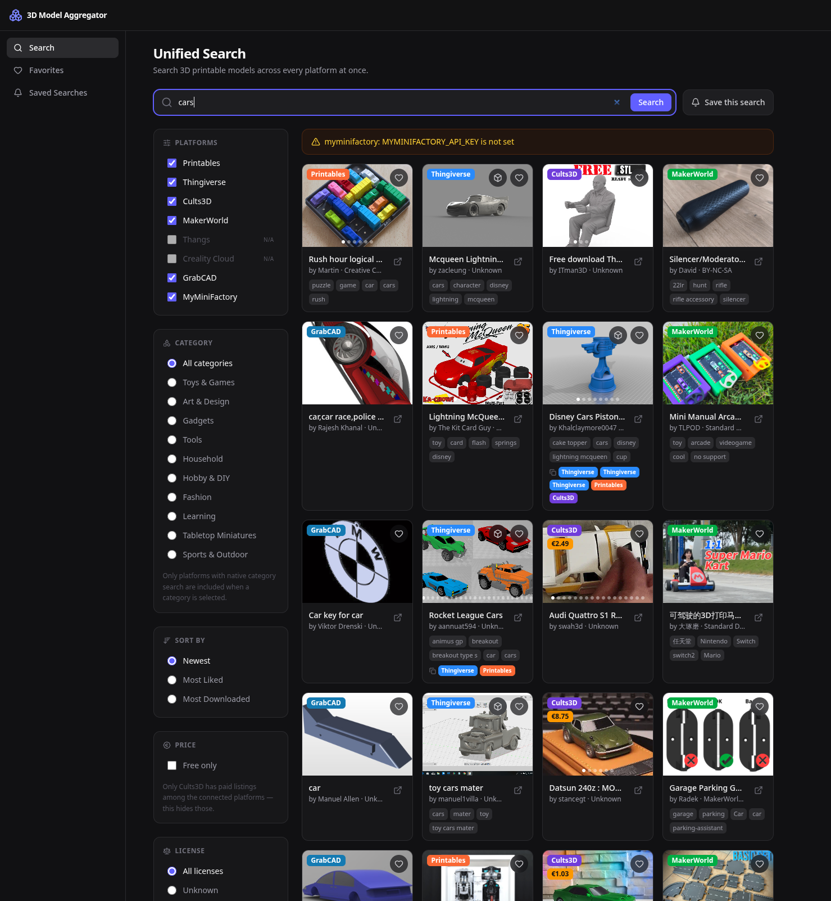
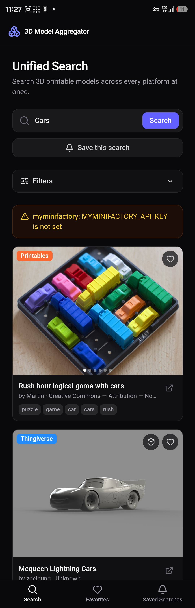

> # Intro (#noAI):
> 
> I built this self-hosted service because I wanted to rely less on online services and subscription-based platforms that lack a self-hosted option where you remain in control. Again, this was the case with an online service that offered aggregated 3D model searching, which worked well but limited API usage and had no option for self-hosting. I used Claude in very simple steps to generate a self-hosted 3D model aggregator with local saves to see how fast I could build a tool offering full data control. In its current state, it is minimal but functional for local use! Included are also the MD files, skills and agents which I have used to build this concept. 


# 3D Model Aggregator

Search 3D printable models across multiple platforms (Printables, Thingiverse, MakerWorld, GrabCAD, Cults3D, MyMiniFactory) from a single dashboard. Filter by category, save results to a local favorites database organized by category, optionally hypothetically sign in with Google to import your likes and collections from linked platform accounts. Reason why I'm saying hypothetically is because I haven't reviewed/tested the code yet that Claude generated for this feature, and for now local favorites is already sufficient for now ;). That said, hopefully this self-hosted aggregator will motivate others to test/and or extend it's features!

The same model often gets reposted across several platforms — search results are deduplicated by default (title-similarity heuristic) and merged into a single card combining the image gallery, tags, and per-platform links, rather than showing every repost separately. Toggleable off if you'd rather see every copy on its own.


| Desktop View | Mobile View |
| :---: | :---: |
|  |  |
|  |  |

Built with Next.js 15, TypeScript, Tailwind CSS, and Prisma (SQLite in dev).

## Features

- **Search** Printables, Thingiverse, MakerWorld, GrabCAD, Cults3D, and MyMiniFactory at once — filter by platform, category, license, tags, or free-only, and sort by newest/most liked/most downloaded.
- **Deduplication & merge**, on by default — reposts of the same model across platforms are combined into one card (gallery, tags, per-platform links); see above, toggleable off.
- **Swipeable image galleries** on cards where a platform actually returns more than one photo (Printables, Cults3D, MyMiniFactory) — click arrows on desktop, swipe on mobile.
- **Favorites**, organized by category, sortable, exportable.
- **Saved searches** — save a query and get flagged when new matches show up next time an hourly background job re-runs it, or hit "Run now" yourself.
- **In-browser 3D preview** for Thingiverse results — the only platform whose model files are fetchable without a login/purchase session.
- Installable as a **PWA** on Android — see Mobile & Android below.
- Optional (hypothetical/untested) Google sign-in to import likes/collections from linked platform accounts. **Can be disabled via env**.

## ⚠️ No security

This is a personal, self-hosted tool intended to run locally. The local favorites database is deliberately **unauthenticated and shared by anyone who can reach the app** — there are no accounts, permissions, or per-user separation for favorites. Do not expose this app to the public internet as-is. 


```bash
npm install
cp .env.example .env.local   # fill in what you need (all optional except for sync)
npx prisma migrate dev
npm run dev
```

Open [http://localhost:3000](http://localhost:3000). Search and favorites work out of the box; some platforms need free API keys (see `.env.example`), and account sync requires Google OAuth credentials.

## 📱 Mobile & Android

Responsive UI (bottom nav, collapsible filters) and installable as a PWA — open it in Chrome on Android and "Install app" for a standalone, full-screen home screen icon. Requires HTTPS or `localhost` (service workers won't register over a plain `http://` LAN address, so put it behind a reverse proxy with TLS for real use; `adb reverse tcp:3000 tcp:3000` works for quick local testing).

Account sync is desktop-only for now — and same disclaimer as above, that feature is still untested/hypothetical either way.

## Disclaimer

Not affiliated with or endorsed by any of the platforms it searches. Some adapters use undocumented endpoints — use at your own risk and respect each platform's terms of service.

## License
 
Dual-licensed:
 
- **[GNU AGPL-3.0](https://www.gnu.org/licenses/agpl-3.0.html)** (default, see [LICENSE](LICENSE)) — free to use, share, and modify, including commercially. If you distribute a modified version or run one as a network service for others, you must make your modified source available under this same license.
- **Commercial license** — if you want to use this software in a closed-source product or service without the AGPL's source-sharing obligations, contact the author (mj.lopes@gmail.com).

Copyright (C) 2026 smii

